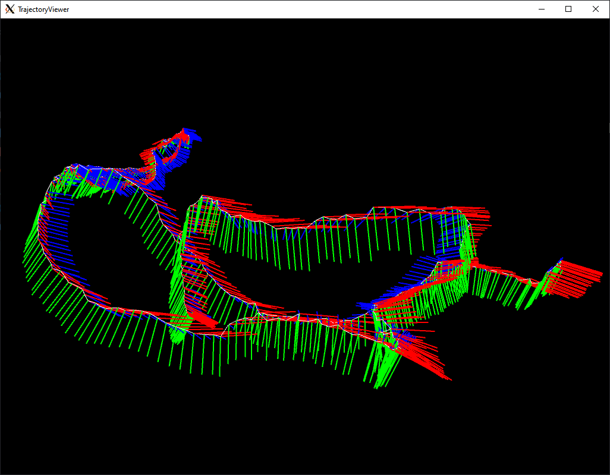

# Pangolin Trajectory Viewer

This project is a starter project to visualize trajectories using Pangolin/OpenGL

**Installation**

Please install the Pangolin and `libeigen3-dev` library first, followed by the commands below
```
mkdir build && cd build
cmake ..
make
```

**Running the App**
```
./trajectory-viewer ../trajectory.txt
```
You should be able to see image like shown below.


